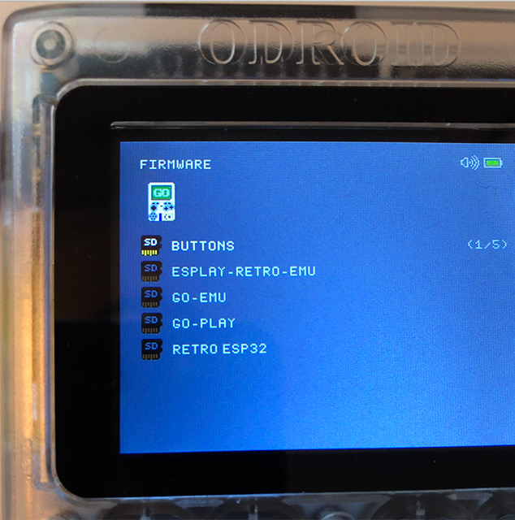
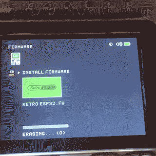

# Retro Odroid Go Firmware
> Something a little different

Based on the [Retro ESP32 GUI](https://github.com/retro-esp32/RetroESP32) 
This is currently a **WORK IN PROGRESS** and is not meant for Odroid Go consumption yet.

Soon 

Progress 
